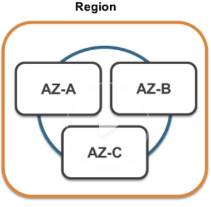

This repo is a concise summary and replacement of the 2016 [AWS Technical Essentials](https://acloud.guru/learn/aws-technical-essentials) tutorial by _A Cloud Guru_.

## 10000 ft Overview 1: Networking & Compute

- __Region__ - a geographic location where AWS resources exist. A region has 2+ availability zones.
- __Availability zone__ - a data center.

- __Edge Location__
    - A Content Delivery Network (CDN) endpoint for CloudFront
    - Can cache very large media (pictures, video).
    - There are many more edge locations than there are regions.
- __VPC__ (Virtual Private Cloud)
    - a virtual data center where you can deploy your assets.
    - Can have multiple VPCs per region.
    - VPCs can be connected to each other.
- __Route 53__
    - Amazon's DNS Service
    - "DNS is the phonebook of the internet" - [source](https://www.cloudflare.com/learning/dns/what-is-dns/)
    - DNS converts a url like www.google.com, to their public IP address.
    - codean register domain names using Route 53.
    - Called Route 53 since port 53 is the DNS port.
- __Cloud Front__ - consists of edge locations that will cache assets such as video.
- __Direct Connect__ - connects your physical data centers to AWS directly, using a dedicated (telephone) line, instead of through the internet. This is useful for security, but most of the time it's for having a reliable connection (which is useful for downloading and uploading a lot of data)
- __EC2__ - "Elastic Compute Cloud". It's just virtual machines in the cloud
- __EC2 Container Service__ - A container management service supporting "docker" containers. Allows you to run applications on a managed cluster of Amazon EC2 instances. Eliminates need for you to install/operate/scale your own cluster management infrastructure.
- __Elastic Beanstalk__ - You can deploy your code here and it will provision all underlying infrastructure for it.
- __Lambda__ - So EC2 is a virtual machine. You can access it using SSH and install things on there. So you have access to the operating system. Lambda is serverless, so you dont go into the operating system, you don't do anything with the underlying host. You just upload your code, and your code will respond to events.
- __Lightsail__ - out of the box cloud. Deploys Wordpress or Juno sites, which you can then customize. For people who don't know AWS.

## 10000 ft Overview 2: Storage, Databases, Migration & Analytics

### Storage

- __S3__ (Simple Storage Service)
    - A virtual disk in the cloud where you can store objects (files, like word/powerpoint documents, pictures, movies, text files)
    - Don't install database or application here. Installing computer games or database would not be in S3, it would be in "block-based storage"
    - Dropbox was one of the first startups to use s3.
- __Glacier__
    - You archive your files off of S3 into here.
    - Extremely low cost
    - Takes 3-4 hours to retrieve your data
- __EFS__ (Elastic File Service)
    - File-based storage, and you can share it.
    - You could install your databases/applications here, and share it with multiple virtual machines
- __Storage Gateway__ - a way of connecting S3 to your on-premise data center
- __EBS__ (Elastic Block Store) - a virtual disk you attach to EC2 instances.

### Databases

- __RDS__ (Relational Database Service) - MySQL, SQL Server, Oracle, etc.
- __DynamoDB__ - a non-relational database (NoSQL database)
- __Redshift__ - Amazon's data warehousing solution. When you have a ton of data and you want to store it in a warehouse and only query it when you want to run reports. (You wouldn't want to query your production database since it would slow it down)
- __Elasticache__ - provides a way of caching your data in the cloud.

### Migration

This section is mostly about migrating on-premise database into the AWS cloud.

- __Snowball__ - moving terabytes of data into cloud using a giant briefcase of data physically mailed to you.
  - __Snowball Edge__ - Instead of just being a Snowball appliance for storage, it has added _compute_ capacity, which lets you have your own AWS on-premise kit.
- __DMS__ (Database Migration Services)
  - Allows you to migrate your on-premise databases to the AWS cloud.
  - Allows you to migrate databases that are in AWS cloud into other regions, or into Redshift, etc.
  - You can do this with production databases without any down-time.
  - During migration, you can convert from 1 database to another (Like Oracle to Aurora)
- __Server Migration Service (SMS)__ - Same as DMS, but instead of it being for databases, it's for virtual machines. Specifically, the VMWare Virtual Machines that run on-premise.

### Analytics

- __Athena__ - allows you to run SQL queries on S3 buckets that have CSV or JSON. It basically turns these flat-files into searchable databases.
- __Elastic Map Reduce (EMR)__
    - For big data processing (such as log analysis, web indexing, or analyzing financial markets)
    - Can use a framework like Hadoop, Spark, Presto, etc.
- __Cloud Search / Elastic Search__
    - Similar products
    - Used if you need to create a search engine.
    - Cloud Search is fully-managed by AWS
    - Elastic Search is open-source
- __Kinesis__
  - A way of streaming/analyzing real-time data
  - Can capture and store terabytes of data per hour
  - Example use case: a sentiment analysis app for social media streams
- __Data Pipeline__
    - Service that lets you move data from 1 place to another
    - Example: move data from S3 into DynamoDB (or vice versa)
- __Quick Sight__
    - A business analytic tool that lets you create visualizations and rich dashboards for your data that exists in AWS.
    - Can analyze data in S3, DynamoDB, RDS, Redshift, etc.

## 10000 ft Overview 3: Security, Management, Tools, Application Services

### Security & Identity

- __IAM__ (Identity Access Management) - for signing into AWS, assigning new users, assigning users permissions, grouping users (administrative group, developer group, read-only group)
- __Inspector__ - inspects virtual machines and does security reporting of what's going on
- __Certificate Manager__ - gives you free SSL certificates for your domain names
- __Directory Service__ - lets you connect "Active Directory" to AWS.
- __WAF__ (Web Application Firewall)
  - gives you application-level protection to your website.
  - a traditional firewall gives you network protection, but a WAF gives you application-level protection (so it can stop things like SQL injection or cross-site scripting)
- __Artifacts__ - it's in your AWS console. Your compliance documents are stored there. (They look like contracts to me). Very simple.

### Management Tools

- __Cloud Watch__ - used to monitor performance of your AWS environment.
- __Cloud Formation__ - a way of turning infrastructure into code. A document that describes your AWS environment.
- __Cloud Trail__ - a way of auditing your AWS resources. So if someone goes into your AWS account and creates a new users, this is documented.
- __Opsworks__ - lets you automate deployments using "Chef"
- __Config Manager__
  - monitors your environment and gives you warnings if your environment might break specific configurations that you set.
  - You can set up alerts with this, so if someone sets up a new security group that's breaking company policy, you can get an alert for this.
- __Service Catalog__ - a service designed for large enterprises. It allows an enterprise to build out what AWS services you authorize (or don't authorize) to be used in your organization.
- __Trusted Advisor__ - an automated way of getting automated tips (such as cost optimization, performance optimization) for your environment.

### Application Services

- __Step Functions__ - a way of visualizing what's going on in your application, and what microservices its using
- __SWF__ (Simple Workflow Service) - a way of coordinating automated tasks and human tasks.
- __API Gateway__
    - allows you to create/publish/maintain/monitor/secure APIs at scale. A door for your apps to access backend data.
    - Example: AngularJS in client device makes call to API Gateway, then API Gateway triggers lambda functions to respond to the requests.
- __AppStream__ - a way of streaming desktop applications to your users
- __Elastic Transcoder__ - changes video format to work with all devices. He uses it for every video he records for acloudguru so that the video format is changed to suite all different devices (ipad, ipad air 2, laptop). You upload a video and it's converted into all of these different formats.

### Developer Tools

- __CodeCommit__ - basically github.
- __CodeBuild__ - a way of compiling your code.
- __CodeDeploy__ - a way of deploying your code to EC2 instances, in a very automated and regulated fashion.
- __CodePipeline__ - a way of keeping track of different versions of code (such as code in 'test' and 'prod' stages)

### Mobile Services

- __Mobile Hub__
    - lets you add, configure, and design features for your mobile apps. This includes user authentication, data storage, backend logic, push notifications, content delivery, and analytics.
    - you have AWS console, but Mobile Hub is it's own console for mobile apps, which contains thing such as AWS Cognito.
    - __Cognito__
        - makes it easy for you to have users sign up and sign into your apps.
        - can sign in using Gmail credentials, and then their first name, surname, email address would be stored in Cognito
- __Device Farm__ - lets you test your app on 100s of devices.
- __Mobile Analytics__ - lets you collect and analyze app usage data.
- __Pinpoint__
  - Lets you understand and engage with your application users.
  - It's like Google Analytics for mobile apps.
  - Lets you understand user behavior since you see what users are doing with your app. Can use this for targeted marketing campaigns: who to engage, what notifications to send.

### Business Productivity

- __WorkDocs__ - securely storing your important work documents in the cloud, with security. It uses s3 but has a bunch of security tied into it.
- __WorkMail__ - a way of sending/receiving email

### Internet of Things

- __iOT__ - a way of keeping track of millions of devices.

### Desktop & App Steaming

- __Workspaces__ - lets you have a desktop in the cloud.

## 10000 ft Overview 4: AI, Messaging & Conclusion

### Artificial Intelligence

- __lex__ - it's what's in Alexa service. You no longer need an "Echo" device to communicate to Alexa. You can embed Alexa in all types of different devices.
- __Polly__ - takes any text and changes into voice (such as into an mp3 file). Polly helps Alexa render her voice. Polly is available in many voices and languages.
- __Machine Learning__ - give AWS a data set, and tell AWS the outcomes of that data set, and you can use this to predict outcomes for future data.
- __Rekognition__ - image recognition service. Can detect faces and objects.

### Messaging

- __SNS__ (Simple Notification Service) - a way of notifying you by email, text message, etc.
- __SQS__
    - a way of decoupling your applications.
    - a queue system. Lets you post jobs to a queue.
    - Example: Lets say u have a website that generates memes, and somebody uploads a picture to the website, and puts some funny writing across it. SQS will store that as a job, and the EC2 instance that creates a picture and puts text across it will poll the SQS queue looking for jobs. If your EC2 instance dies while trying to make this, the message will still stay in the SQS queue.
- __SES__ (Simply Email Service) - a way of sending/receiving emails using AWS.
